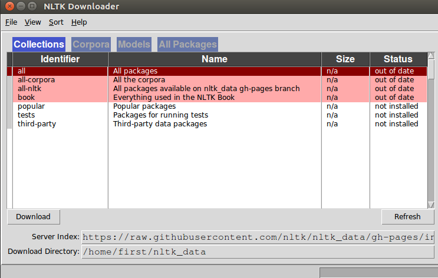
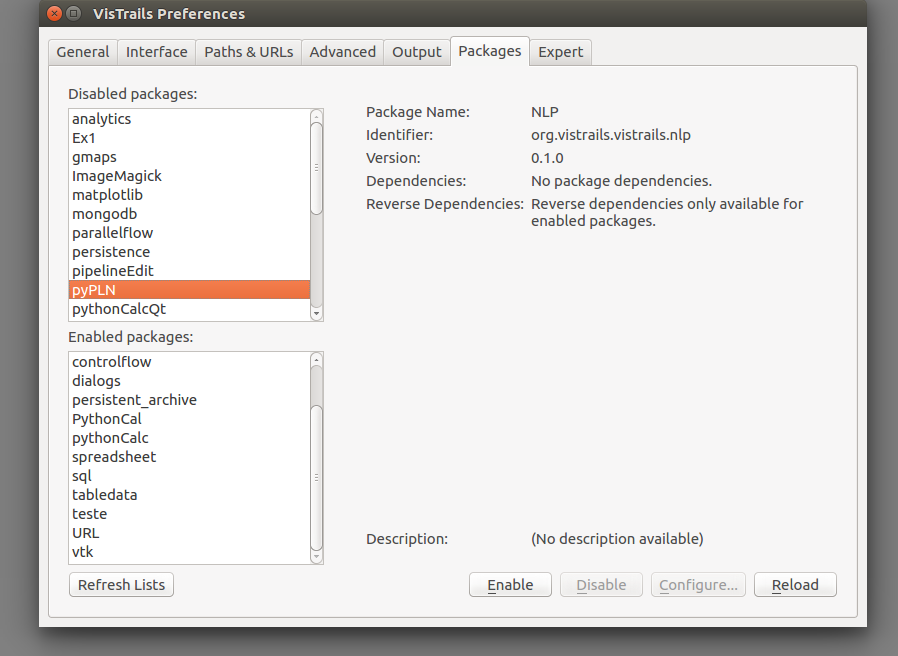
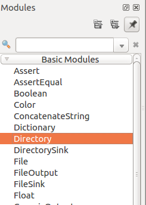
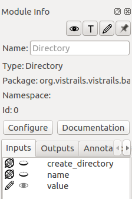
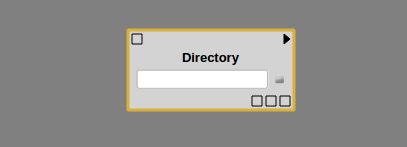
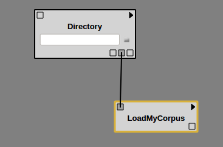
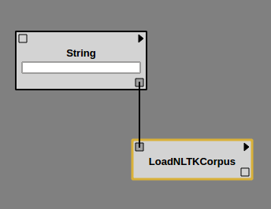

# First Steps into NLP

## NLTK Package

### Setting up

The NLTK Package can be easily installed via pip through the terminal. If you're using unix, type;

     sudo pip install nltk

It is better to setup the package before Vistrails use to avoid substantial errors through installation. Furthermore, it would be recommended also to setup the NLTK environment by previously downloading the package's content. Use the command
 
    sudo python
    >import nltk
    >nltk.download()

It will open an window to manage and download the desired NLTK's content.

    
To download all the data, run **

    python -m nltk.downloader all

If necessary, there is an available module inside the NLP Package called "DownloadCorpus" that executes the script above.

** The corpora is an extense content and the download process may be long.
*** '>' indicates the Python Environment

### Getting Started

The Natural Language Processing (NLP) must be enabled for use. Acess Edit->Packages and select the package.

The NLTK lib provides tools for processing text and so some samples for the users. However, it is possible, also, to process the users provided data. Above, some instructions to use or create a corpus, a group of text, for exploration.

### Acessing your own corpus

To access your corpus to use it on the workflow, first it is necessary to create a variable for it. There is a specif type for directories inside the menu Basics.

Drag the module to the panel and select it. On the right-sided menu, above the options click on the Pencil icon 

to use the input mode inside the modules - is expected that the Directory Module shows an entry-text box.

Input the refered directory or select it through the widget button besides the entry-box.

The module can be linked, then, to the NLP package's module "LoadMyModule" using the output port(Directory) - if the box are put close to each other the link is automatical. 

This box will load the corpus and create an object to be used as a corpus by NLTK. 

### Acessing an NLTK Corpus

Before you load, there is a Module "ShowNLTKCorpus" that presents the corpus available in the toolkit. Then, you can choose one the corpuses and use it as an input of type String inside the module 'LoadNLTKCorpus' which will output an object of type Corpus to be used in the workflow.

An example of workflow is available in the "example/nlp" folder called "loadnltkmodule".
